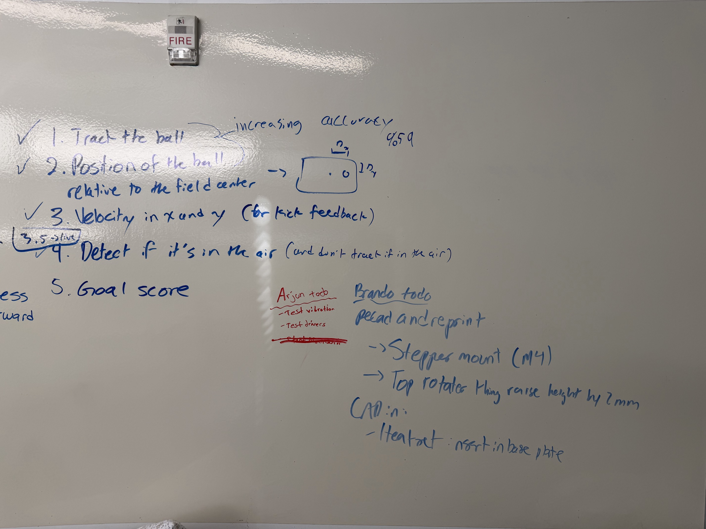
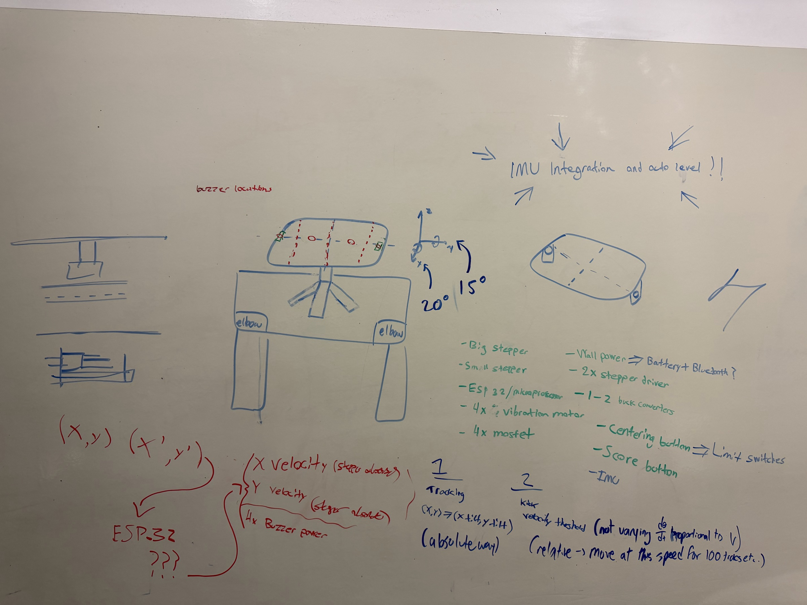
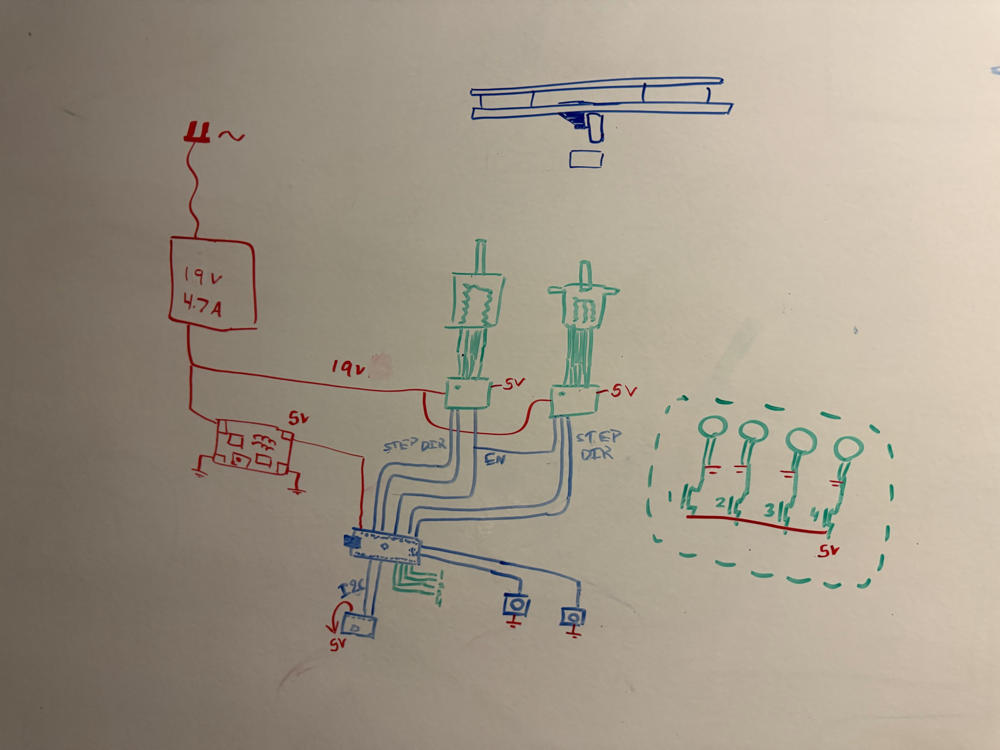
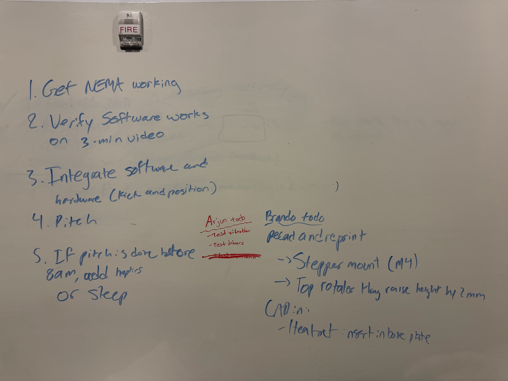

# Planning notes

Photos of our whiteboard from the hackathon, in the order they were taken.

## IMG_0067 — software goals and first to-do lists

The software goals for the ball tracker, checked off as we finished them:

1. Track the ball (arrow: "increasing accuracy", about 59% of frames at that point)
2. Position of the ball relative to the field centre (sketch of the pitch with the centre spot as the origin)
3. Velocity in x and y, for the kick feedback
4. Detect if the ball is in the air, and don't track it while it is
5. Goal score

"3.5 → live" was squeezed in between steps 3 and 4: an idea to run the tracker live. We later dropped it for a pre-processed clip.

To-do lists:
- **Arjun:** test the vibration motors, test the stepper drivers.
- **Brando:** re-CAD and reprint the stepper mount (M4) and raise the top rotating part by 2 mm. In CAD: heat-set inserts in the base plate.

## IMG_0076 — device design

- **Device:** a tilting board shaped like a pitch on a stand, with elbow rests on both sides. It tilts up to 20° around x and 15° around y. Buzzer locations are marked on the board.
- **Stretch goal:** "IMU integration and auto level!!"
- **Parts list:** big stepper, small stepper, ESP32, 4× vibration motors, 4× MOSFETs, 2× stepper drivers, 1–2 buck converters, a centring button (later limit switches), a score button and an IMU. Wall power for now, maybe battery and Bluetooth later.
- **Data flow:** ball position (x, y) and velocity (x′, y′) go to the ESP32. The ESP32 drives the X stepper, the Y stepper and power to the 4 buzzers.
- **Two motor modes:**
  1. **Tracking:** position (x, y) maps directly to a tilt angle for each axis (absolute).
  2. **Kick:** when the speed passes a threshold, the board moves at a set speed for a fixed number of ticks (e.g. 100) in the direction of the kick. The speed is fixed, not proportional to the ball's speed (relative).

## IMG_0075 — wiring diagram

- **Power:** wall plug → 19 V / 4.7 A supply. 19 V goes to both stepper drivers, and a buck converter steps it down to 5 V for the logic.
- **Steppers:** the ESP32 drives each driver with STEP and DIR lines, plus a shared EN line.
- **Other ESP32 connections:** an I2C device (IMU) on 5 V and two push buttons to ground.
- **Vibration motors:** four of them on 5 V, each switched by a MOSFET from ESP32 pins 1–4 (dashed box).
- **Top of the board:** a side view of the tilting platform on the stepper shaft.

## IMG_0077 — plan for the final night

1. Get the NEMA stepper working
2. Verify the software works on a 3-minute video
3. Integrate software and hardware (kick and position)
4. Pitch
5. If the pitch is done before 8 am, add haptics, or sleep

The to-do lists from IMG_0067 are still up on the right.
